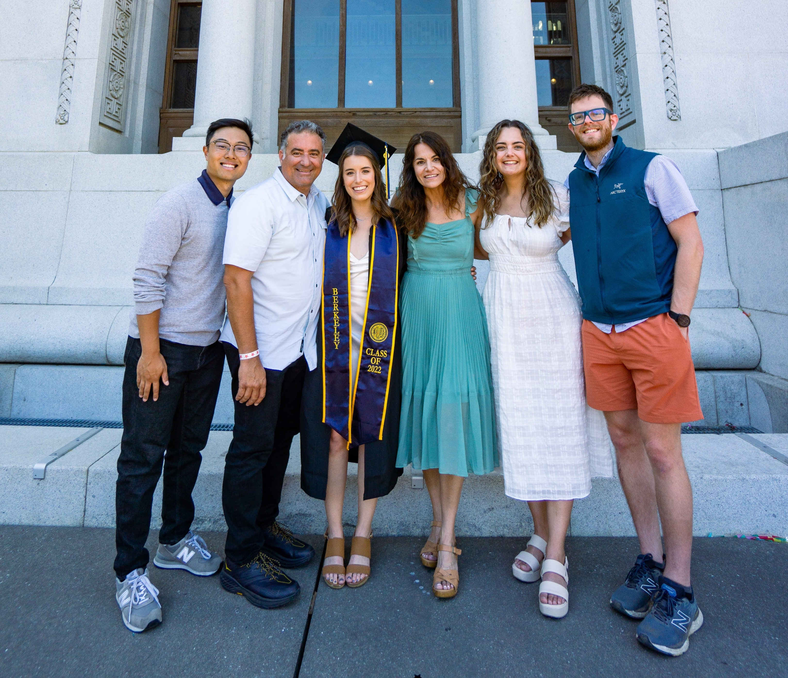

## Hello! 

The purpose of this website is to provide a professional website about me and my achievements to complete a homework assignment for course: P8105 Data Science at Columbia University. 

### About Me:

I am a first year PhD student at Columbia University's Mailman School of Public Health, studying Environmental Health Sciences. To learn more about my academic and professional experience: [click here!](about.html)

I grew up in Southern California in the most wonderful family pictured below at my college graduation:

### My interests: 
I enjoy running, reading, cooking and learning new things. My favorite color is purple and I have a huge sweet tooth (which is tricky sometimes since I do have an allergy to gluten). 

### A small note....
This website is a culmination of some amazing skills I have learned as a beginner coder and I am very proud with how far I have come with my confidence in using R. 
